# The Zynq Book Tutorial 4 - Tạo IP Core

Phiên bản biên soạn lại cho **Vivado/Vitis 2022.2** và yêu cầu dùng **Verilog**.

Tài liệu này dựa trên `Tutorial 4.pdf` nhưng đã cập nhật flow từ Vivado 2014.1 sang Vivado 2022.2. Khi đọc các hình minh họa cũ trong PDF, ta dùng chúng để hiểu ý nghĩa thao tác; còn menu/thao tác chính trong phần chữ dưới đây là phiên bản cần làm với Vivado/Vitis 2022.2.

## Lưu ý cập nhật cho Vivado/Vitis 2022.2

Trong bản gốc, bài lab dùng Vivado 2014.1, Vivado HLS và Xilinx SDK. Với bộ công cụ 2022.2, ta đổi như sau:

| Nội dung trong bản 2014.1 | Cách làm trong bản 2022.2 |
| --- | --- |
| `Tools > Create and Package IP` | `Tools > Create and Package New IP...` |
| Target language chọn VHDL | Target language chọn **Verilog** |
| File HDL `.vhd` | File HDL `.v` |
| Vivado HLS | **Vitis HLS 2022.2** |
| SDK | **Vitis IDE 2022.2** |
| Export Hardware for SDK | `File > Export > Export Hardware...`, xuất file `.xsa` và chọn **Include bitstream** |
| Application Project trong SDK | Platform Project từ `.xsa`, sau đó tạo Application Project trong Vitis |

Nếu trong tab **Boards** không thấy **ZedBoard Zynq Evaluation and Development Kit**, ta cài board files từ Xilinx Board Store hoặc thêm board repository trong Vivado. Nếu vẫn không có, ta có thể chọn part thủ công là `xc7z020clg484-1`, nhưng khi đó ta cần tự cấu hình Zynq PS hoặc cài board preset để block automation làm đúng.

Ta nên đặt project trong đường dẫn ngắn, không dấu và ít khoảng trắng, ví dụ:

```text
C:\Zynq_Book
```

hoặc:

```text
D:\Zynq_Book_Lab04
```

Trong các bước bên dưới, tài liệu dùng `C:\Zynq_Book` để giữ gần giống tutorial gốc.

## Introduction

Hướng dẫn này trình bày quy trình tạo các IP tùy chỉnh tương thích với Vivado IP Integrator từ nhiều nguồn khác nhau. Tất cả IP được tạo trong bài này sẽ dùng giao tiếp **AXI4-Lite** do Xilinx/AMD hỗ trợ, và khi tích hợp trong Vivado IP Integrator, các IP này sẽ đóng vai trò **slave device** để phần mềm chạy trên PS có thể điều khiển phần cứng trong PL.

Các phương pháp tạo IP được đề cập gồm:

- HDL, trong bài này ta dùng **Verilog**.
- MathWorks HDL Coder, trong bài này ta cấu hình sinh **Verilog**.
- Vitis HLS, trong bài này ta dùng C/C++ làm đầu vào HLS và cấu hình RTL output là **Verilog**.

Hướng dẫn được chia thành ba bài tập:

**Bài tập 4A** - Trong bài này, ta tạo một bộ điều khiển LED bằng Verilog. IP này cho phép phần mềm chạy trên Zynq PS ghi dữ liệu qua AXI4-Lite để điều khiển 8 LED trên ZedBoard. Ta sẽ dùng Create and Package New IP Wizard để tạo template AXI4-Lite, thêm logic LED, đóng gói IP, đưa IP vào block design, generate bitstream và viết chương trình C trong Vitis để điều khiển LED.

**Bài tập 4B** - Trong bài này, ta dùng MathWorks HDL Coder để sinh IP từ một mô hình Simulink LMS noise cancellation filter. Ta sẽ mở mô hình LMS, kiểm tra cấu hình HDL, chạy HDL Workflow Advisor, chọn workflow IP Core Generation, chọn Verilog làm ngôn ngữ sinh HDL, sau đó đóng gói IP để dùng trong Vivado IP Integrator.

**Bài tập 4C** - Trong bài này, ta dùng Vitis HLS để tạo IP cho một Numerically Controlled Oscillator (NCO). Ta sẽ mô phỏng thuật toán C/C++, thêm directive để tạo giao tiếp AXI4-Lite, chạy C Synthesis và export RTL thành IP tương thích Vivado IP Catalog.

---

# Exercise 4A: Creating IP in HDL

## Creating IP in HDL

Vì Zynq gồm hai phần PS và PL, hầu hết IP chạy trong PL cần giao tiếp được với phần mềm chạy trên PS. Để làm được điều này, IP phải được đóng gói với một giao tiếp mà PS có thể truy cập được. Trong bài này, ta dùng giao tiếp **AXI4-Lite**.

Khi tạo IP bằng HDL, Vivado cung cấp template AXI thông qua **Create and Package New IP Wizard**. Wizard này giúp ta làm hai việc chính: tạo template AXI4 peripheral mới, và đóng gói source HDL thành IP để dùng trong Vivado IP Integrator.

Trong bài tập này, ta sẽ tạo một template AXI4-Lite, thêm output port nối tới 8 LED của ZedBoard, ánh xạ dữ liệu từ thanh ghi AXI `slv_reg0` ra LED, sau đó đóng gói IP và kết nối IP này với Zynq Processing System.

Ta bắt đầu bằng cách tạo project Vivado mới.

## Tạo project Vivado

(a) Ta mở **Vivado 2022.2** bằng icon trên Desktop hoặc từ Start Menu:

```text
Start > Xilinx Design Tools > Vivado 2022.2
```

(b) Tại màn hình Getting Started, ta chọn **Create Project**.

(c) Hộp thoại **New Project** mở ra, ta chọn **Next**.

(d) Tại trang **Project Name**, ta nhập:

- Project name: `led_controller`
- Project location: `C:\Zynq_Book`
- Chọn **Create project subdirectory**

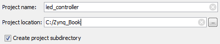

*Hình 4.1: Thiết lập tên project `led_controller`. Hình gốc dùng Vivado 2014.1; trong Vivado 2022.2 ý nghĩa các trường vẫn tương tự.*

Ta chọn **Next**.

(e) Tại trang **Project Type**, ta chọn **RTL Project**. Ta không cần thêm source ở bước này, nhưng để chọn ngôn ngữ target trong trang sau, ta để tùy chọn **Do not specify sources at this time** không được chọn.

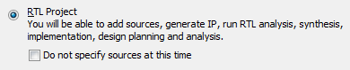

*Hình 4.2a: Chọn RTL Project. Đây là hình minh họa từ bản cũ, dùng để đối chiếu ý nghĩa lựa chọn.*

Ta chọn **Next**.

(f) Tại trang **Add Sources**, ta chọn:

- Target language: **Verilog**
- Simulator language: **Mixed** hoặc **Verilog**

Vì ta chưa có source HDL để thêm vào project, ta chọn **Next**.

(g) Tại trang **Add Constraints**, hiện tại ta chưa thêm XDC nên chọn **Next**.

(h) Tại trang **Default Part**, ta chọn tab **Boards** và tìm:

```text
ZedBoard Zynq Evaluation and Development Kit
```

Sau đó ta chọn đúng board revision nếu Vivado hiển thị.

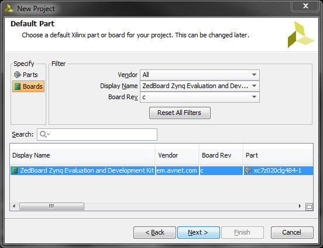

*Hình 4.2: Chọn board ZedBoard trong Default Part. Nếu Vivado 2022.2 không thấy board, ta cần cài board files hoặc chọn part `xc7z020clg484-1`.*

Ta chọn **Next**, kiểm tra trang Summary, rồi chọn **Finish** để tạo project.

## Tạo AXI4-Lite peripheral bằng Verilog

(i) Trong Vivado, từ menu bar ta chọn:

```text
Tools > Create and Package New IP...
```

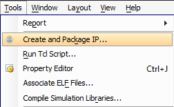

*Hình 4.3: Menu tạo và đóng gói IP. Trong Vivado 2022.2 tên menu thường là `Create and Package New IP...`.*

(j) Wizard **Create and Package New IP** mở ra, ta chọn **Next**.

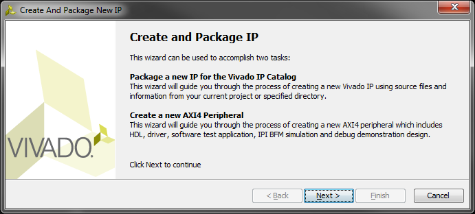

*Hình 4.4: Màn hình mở đầu của Create and Package IP Wizard.*

(k) Ở trang chọn kiểu tạo IP, ta chọn:

```text
Create a new AXI4 peripheral
```

Sau đó chọn **Next**.

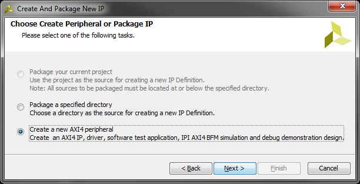

*Hình 4.5: Chọn tạo AXI4 peripheral mới.*

(l) Tại trang **Peripheral Details**, ta nhập:

- Name: `led_controller`
- Version: `1.0`
- Display name: `led_controller_v1.0`
- Description: `led_controller_v1.0`
- IP location: `C:\Zynq_Book\ip_repo`

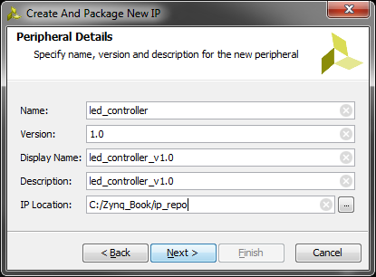

*Hình 4.6: Thông tin VLNV và vị trí lưu IP.*

Ta chọn **Next**.

(m) Tại trang **Add Interfaces**, ta cấu hình interface:

- Name: `S00_AXI`
- Interface Type: **Lite**
- Interface Mode: **Slave**
- Data Width: **32**
- Number of Registers: **4**
- Enable Interrupt Support: không chọn

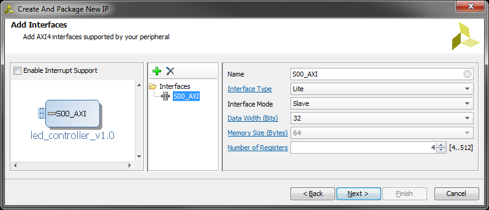

*Hình 4.7: Cấu hình AXI4-Lite slave interface cho IP `led_controller`.*

Ta chọn **Next**.

(n) Tại trang **Create Peripheral**, ta chọn **Edit IP** để Vivado tạo một project phụ cho phép chỉnh sửa source HDL của IP. Sau đó ta chọn **Finish**.

Vivado sẽ mở project chỉnh sửa IP, thường có tên:

```text
edit_led_controller_v1_0
```

Vì ở bước tạo project ta đã chọn **Verilog**, Vivado sẽ sinh hai file chính:

- `led_controller_v1_0.v` - file top-level của IP, instantiate các AXI interface.
- `led_controller_v1_0_S00_AXI.v` - file chứa logic AXI4-Lite slave, các thanh ghi `slv_reg0`, `slv_reg1`, `slv_reg2`, `slv_reg3`.

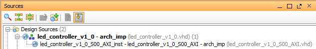

*Hình 4.8a: Danh sách source HDL trong project chỉnh sửa IP. Hình gốc là VHDL; với yêu cầu của ta, file sẽ là `.v`.*

## Thêm cổng LED vào file AXI Verilog

(o) Ta mở file:

```text
led_controller_v1_0_S00_AXI.v
```

(p) Trong phần khai báo port của module, ta tìm comment:

```verilog
// Users to add ports here
```

Ngay dưới comment đó, ta thêm output port:

```verilog
// Users to add ports here
output wire [7:0] LEDs_out,
// User ports ends
```

Lưu ý dấu phẩy sau `LEDs_out`, vì phía sau vẫn còn các port AXI như `S_AXI_ACLK`, `S_AXI_ARESETN`, ...

(q) Ta kéo xuống gần cuối file, tìm comment:

```verilog
// Add user logic here
```

Ngay dưới comment đó, ta thêm:

```verilog
assign LEDs_out = slv_reg0[7:0];
```

Dòng này lấy 8 bit thấp của thanh ghi AXI `slv_reg0` để đưa ra 8 LED.

(r) Ta lưu file bằng **Ctrl+S**.

## Thêm cổng LED vào file top-level Verilog

(s) Ta mở file:

```text
led_controller_v1_0.v
```

(t) Trong phần khai báo port của module top-level, ta tìm:

```verilog
// Users to add ports here
```

Ngay dưới comment đó, ta thêm:

```verilog
// Users to add ports here
output wire [7:0] LEDs_out,
// User ports ends
```

(u) Trong phần instantiate module `led_controller_v1_0_S00_AXI`, ta thêm kết nối port `LEDs_out`.

Ví dụ, đoạn instance sẽ có dạng:

```verilog
led_controller_v1_0_S00_AXI # (
    .C_S_AXI_DATA_WIDTH(C_S00_AXI_DATA_WIDTH),
    .C_S_AXI_ADDR_WIDTH(C_S00_AXI_ADDR_WIDTH)
) led_controller_v1_0_S00_AXI_inst (
    .LEDs_out(LEDs_out),
    .S_AXI_ACLK(s00_axi_aclk),
    .S_AXI_ARESETN(s00_axi_aresetn),
    .S_AXI_AWADDR(s00_axi_awaddr),
    .S_AXI_AWPROT(s00_axi_awprot),
    .S_AXI_AWVALID(s00_axi_awvalid),
    .S_AXI_AWREADY(s00_axi_awready),
    .S_AXI_WDATA(s00_axi_wdata),
    .S_AXI_WSTRB(s00_axi_wstrb),
    .S_AXI_WVALID(s00_axi_wvalid),
    .S_AXI_WREADY(s00_axi_wready),
    .S_AXI_BRESP(s00_axi_bresp),
    .S_AXI_BVALID(s00_axi_bvalid),
    .S_AXI_BREADY(s00_axi_bready),
    .S_AXI_ARADDR(s00_axi_araddr),
    .S_AXI_ARPROT(s00_axi_arprot),
    .S_AXI_ARVALID(s00_axi_arvalid),
    .S_AXI_ARREADY(s00_axi_arready),
    .S_AXI_RDATA(s00_axi_rdata),
    .S_AXI_RRESP(s00_axi_rresp),
    .S_AXI_RVALID(s00_axi_rvalid),
    .S_AXI_RREADY(s00_axi_rready)
);
```

Trong Verilog, ta không cần thêm component declaration như VHDL. Ta chỉ cần thêm port ở top-level và kết nối port trong instance.

(v) Ta lưu file bằng **Ctrl+S**.

## Re-package IP

(w) Ta quay lại tab **Package IP - led_controller**.

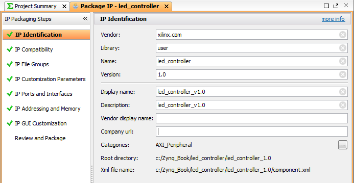

*Hình 4.8b: Cửa sổ IP Packager. Hình gốc dùng giao diện 2014.1, nhưng các mục IP Identification, IP Ports and Interfaces, Review and Package vẫn tương tự trong 2022.2.*

(x) Nếu Vivado báo các mục cần refresh, ta chọn **IP Customization Parameters** và bấm:

```text
Merge changes from IP Customization Parameters Wizard
```


*Hình 4.8c: Merge thay đổi từ source HDL vào IP Packager.*

(y) Ta chọn **IP Ports and Interfaces** và kiểm tra đã có port:

```text
LEDs_out
```

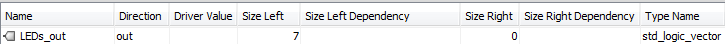

*Hình 4.8d: Port `LEDs_out` đã được IP Packager nhận diện.*

(z) Ta chọn **Review and Package**. Nếu có tùy chọn tạo archive, ta bật:

```text
Create archive of IP
```

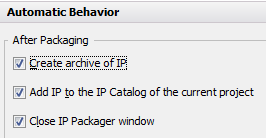

*Hình 4.8e: Tạo file archive ZIP cho IP sau khi đóng gói.*

Sau đó ta chọn **Package IP** hoặc **Re-Package IP**. Khi đóng gói xong, Vivado sẽ quay lại project ban đầu `led_controller`.

## Tạo block design kiểm tra IP

(aa) Trong project `led_controller`, ở Flow Navigator ta chọn:

```text
IP Integrator > Create Block Design
```

Ta nhập Design name:

```text
led_test_system
```

Sau đó chọn **OK**.

(ab) Trong canvas trắng của block design, ta bấm chuột phải và chọn **Add IP**, hoặc nhấn **Ctrl+I**. Ta tìm:

```text
led_controller
```

Rồi double-click để thêm IP vào block design.

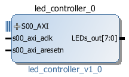

*Hình 4.8: Block `led_controller` sau khi thêm vào block design.*

(ac) Ta đưa port `LEDs_out` ra ngoài bằng cách bấm chuột phải vào port đó và chọn:

```text
Make External
```

Nếu Vivado tự đặt tên external port là `LEDs_out_0`, ta đổi tên lại thành:

```text
LEDs_out
```

Việc này giúp file XDC bên dưới khớp tên port. Nếu ta không đổi tên, ta phải thay toàn bộ `LEDs_out` trong XDC bằng tên port thực tế mà Vivado tạo.

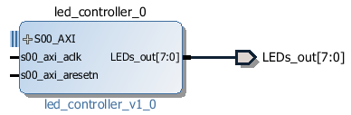

*Hình 4.9: Port `LEDs_out[7:0]` đã được Make External.*

(ad) Ta thêm IP:

```text
ZYNQ7 Processing System
```

(ae) Khi Vivado hiện **Run Block Automation**, ta chọn:

```text
Run Block Automation > processing_system7_0
```

Trong hộp thoại hiện ra, ta chọn **Apply Board Preset** rồi chọn **OK**.


*Hình 4.10a: Designer Assistance cho phép chạy Block Automation và Connection Automation.*

(af) Ta chọn:

```text
Run Connection Automation > led_controller_0/S00_AXI
```

Sau đó chọn **OK**. Vivado sẽ tự thêm AXI Interconnect hoặc AXI SmartConnect, Processor System Reset và nối clock/reset phù hợp.

(ag) Ta mở tab **Address Editor** và kiểm tra IP `led_controller_0` đã được gán base address. Thường địa chỉ sẽ gần dạng:

```text
0x43C0_0000
```

Nếu chưa có địa chỉ, ta chọn **Assign All**.

(ah) Ta validate block design:

```text
Tools > Validate Design
```

hoặc nhấn **F6**.


*Hình 4.10b: Nút Validate Design trong Vivado.*

Nếu Vivado báo validation successful, ta chọn **OK**.

(ai) Trong tab **Sources**, ta bấm chuột phải vào `led_test_system.bd` và chọn:

```text
Create HDL Wrapper
```

Ta chọn:

```text
Let Vivado manage wrapper and auto-update
```

Sau đó chọn **OK**.

## Tạo file ràng buộc chân LED

(aj) Trong Flow Navigator, ta chọn:

```text
Project Manager > Add Sources
```

(ak) Ta chọn **Add or Create Constraints**, rồi chọn **Next**.

(al) Ta chọn **Create File...**, cấu hình:

- File type: `XDC`
- File name: `led_constraints`

Sau đó chọn **OK**, rồi chọn **Finish**.

(am) Ta mở file `led_constraints.xdc` và thêm các dòng sau:

```tcl
set_property PACKAGE_PIN T22        [get_ports {LEDs_out[0]}]
set_property IOSTANDARD LVCMOS33    [get_ports {LEDs_out[0]}]
set_property PACKAGE_PIN T21        [get_ports {LEDs_out[1]}]
set_property IOSTANDARD LVCMOS33    [get_ports {LEDs_out[1]}]
set_property PACKAGE_PIN U22        [get_ports {LEDs_out[2]}]
set_property IOSTANDARD LVCMOS33    [get_ports {LEDs_out[2]}]
set_property PACKAGE_PIN U21        [get_ports {LEDs_out[3]}]
set_property IOSTANDARD LVCMOS33    [get_ports {LEDs_out[3]}]
set_property PACKAGE_PIN V22        [get_ports {LEDs_out[4]}]
set_property IOSTANDARD LVCMOS33    [get_ports {LEDs_out[4]}]
set_property PACKAGE_PIN W22        [get_ports {LEDs_out[5]}]
set_property IOSTANDARD LVCMOS33    [get_ports {LEDs_out[5]}]
set_property PACKAGE_PIN U19        [get_ports {LEDs_out[6]}]
set_property IOSTANDARD LVCMOS33    [get_ports {LEDs_out[6]}]
set_property PACKAGE_PIN U14        [get_ports {LEDs_out[7]}]
set_property IOSTANDARD LVCMOS33    [get_ports {LEDs_out[7]}]
```

Nếu external port của ta tên là `LEDs_out_0`, ta sửa XDC thành:

```tcl
[get_ports {LEDs_out_0[0]}]
```

và tương tự cho các bit còn lại.

(an) Ta lưu file XDC.

## Generate Bitstream

(ao) Trong Flow Navigator, ta chọn:

```text
Program and Debug > Generate Bitstream
```

Nếu Vivado hỏi có chạy Synthesis và Implementation không, ta chọn **Yes**.

(ap) Khi bitstream generation hoàn tất, ta có thể chọn **Open Implemented Design** để kiểm tra, hoặc chọn **Cancel** nếu muốn chuyển ngay sang bước export hardware.

## Export hardware sang Vitis 2022.2

Trong bản gốc, bước này xuất sang SDK. Với Vivado 2022.2, ta xuất file `.xsa` cho Vitis.

(aq) Trong Vivado, ta chọn:

```text
File > Export > Export Hardware...
```

(ar) Ta chọn:

```text
Include bitstream
```

(as) Ta lưu file XSA, ví dụ:

```text
C:\Zynq_Book\led_controller\led_controller.xsa
```

Sau đó chọn **Finish**.

## Tạo platform và application trong Vitis

(at) Ta mở **Vitis 2022.2**:

```text
Start > Xilinx Design Tools > Vitis 2022.2
```

hoặc chạy:

```text
C:\Xilinx\Vitis\2022.2\bin\vitis.bat
```

Ta chọn workspace, ví dụ:

```text
C:\Zynq_Book\vitis_workspace
```

(au) Ta tạo platform project:

```text
File > New > Platform Project
```

Ta nhập tên:

```text
led_controller_platform
```

Sau đó chọn **Next**.

(av) Ta chọn:

```text
Create from hardware specification (XSA)
```

Rồi browse tới file:

```text
C:\Zynq_Book\led_controller\led_controller.xsa
```

(aw) Ta chọn domain:

- Processor: `ps7_cortexa9_0`
- Operating system: `standalone`
- CPU: Cortex-A9

Sau đó chọn **Finish** và build platform.

(ax) Ta tạo application project:

```text
File > New > Application Project
```

Ta chọn platform `led_controller_platform`, rồi nhập Project name:

```text
LED_Controller_test
```

Ta chọn domain `standalone`, ngôn ngữ **C**, template **Empty Application**, rồi chọn **Finish**.

## Viết chương trình C điều khiển LED

Trong bản gốc, SDK import file C có sẵn và có thể dùng driver sinh tự động. Với Vitis 2022.2, cách ổn định nhất cho lab là ghi trực tiếp vào thanh ghi AXI bằng `Xil_Out32`.

Ta tạo file:

```text
src/led_controller_test.c
```

với nội dung:

```c
#include "xparameters.h"
#include "xil_io.h"
#include "xil_printf.h"
#include "sleep.h"

/*
 * Nếu macro này không đúng trong project của ta, mở xparameters.h
 * và tìm macro BASEADDR tương ứng với instance led_controller_0.
 */
#define LED_CONTROLLER_BASEADDR XPAR_LED_CONTROLLER_0_S00_AXI_BASEADDR
#define LED_REG0_OFFSET 0x00U

int main(void)
{
    unsigned int value;

    xil_printf("led_controller IP test begin.\r\n");

    while (1) {
        for (value = 0; value < 256; value++) {
            Xil_Out32(LED_CONTROLLER_BASEADDR + LED_REG0_OFFSET, value);
            xil_printf("LED value: %u\r\n", value);
            usleep(200000);
        }
    }

    return 0;
}
```

Ta build application. Nếu lỗi macro `XPAR_LED_CONTROLLER_0_S00_AXI_BASEADDR`, ta mở `xparameters.h` và tìm dòng chứa `LED_CONTROLLER`. Macro có thể có tên hơi khác, ví dụ:

```c
XPAR_LED_CONTROLLER_0_BASEADDR
```

Khi đó ta thay macro trong file C cho đúng.

Nếu thầy yêu cầu dùng driver do IP Packager sinh ra, ta thêm repository driver vào Vitis:

```text
Xilinx > Repositories > New
```

và trỏ tới thư mục IP repository, ví dụ:

```text
C:\Zynq_Book\ip_repo\led_controller_1.0
```

Sau đó ta refresh/rebuild platform hoặc domain BSP. Tuy nhiên, với IP AXI4-Lite đơn giản, dùng `Xil_Out32` vẫn đúng bản chất: PS ghi vào thanh ghi AXI của IP.

## Program FPGA và chạy application

(ay) Ta kết nối ZedBoard:

- Cắm nguồn.
- Cắm USB JTAG.
- Cắm USB UART.
- Đặt boot mode phù hợp để chạy qua JTAG nếu cần.

(az) Trong Vitis, ta program FPGA:

```text
Xilinx > Program FPGA
```

Vitis thường tự lấy bitstream từ platform. Nếu không, ta browse tới file `.bit` trong project Vivado.

(ba) Ta mở terminal serial. Có thể dùng terminal trong Vitis hoặc Tera Term/PuTTY:

- Baud rate: `115200`
- Data bits: `8`
- Parity: `None`
- Stop bits: `1`
- Flow control: `None`

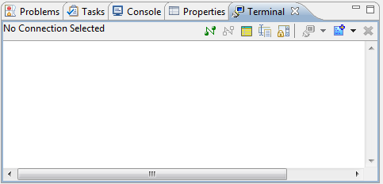

*Hình 4.14: Terminal trong SDK bản cũ. Trong Vitis 2022.2, ta có thể dùng Vitis Serial Terminal hoặc phần mềm terminal ngoài.*

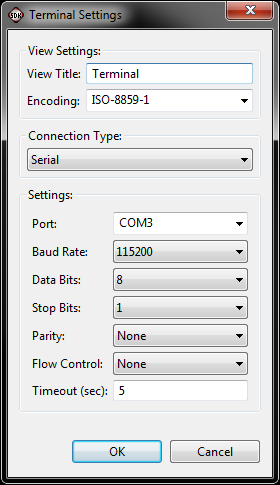

*Hình 4.15: Cấu hình UART 115200 8N1.*

(bb) Ta chạy application:

```text
Run As > Launch on Hardware
```

hoặc tạo Run Configuration cho application rồi chạy.

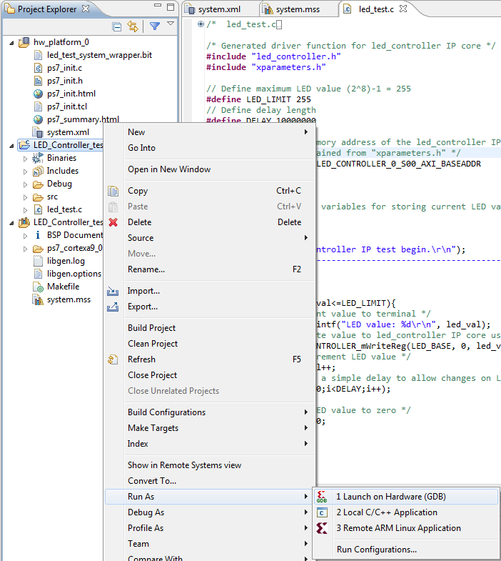

*Hình 4.16: Chạy application trên phần cứng trong SDK bản cũ. Trong Vitis 2022.2, thao tác tương ứng là launch application trên hardware target.*

(bc) Ta quan sát terminal. Nếu đúng, terminal sẽ in các giá trị LED, và LED trên ZedBoard sẽ thay đổi theo giá trị ghi vào `slv_reg0`.

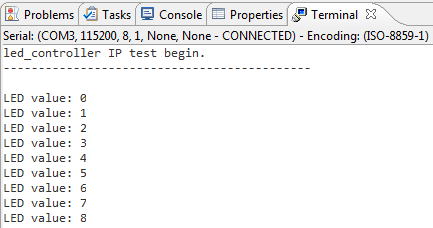

*Hình 4.17: Terminal hiển thị giá trị LED. Đây là kết quả mong đợi sau khi PS ghi dữ liệu qua AXI4-Lite vào IP trong PL.*

Kết thúc bài tập 4A, ta đã biết:

- Tạo AXI4-Lite IP template bằng Create and Package New IP Wizard.
- Thêm logic Verilog vào IP AXI4-Lite.
- Đóng gói IP để dùng trong Vivado IP Integrator.
- Kết nối custom IP với Zynq Processing System.
- Export hardware sang Vitis bằng file `.xsa`.
- Viết chương trình C để PS điều khiển phần cứng trong PL.

---

# Exercise 4B: Creating IP in MathWorks HDL Coder

## Creating IP in MathWorks HDL Coder

Trong bài tập này, ta tạo một IP core thực hiện chức năng **LMS noise cancellation filter**. MathWorks HDL Coder sẽ chuyển một mô hình Simulink sang RTL, sau đó IP này được đóng gói để dùng trong Vivado IP Catalog.

Lưu ý quan trọng: tutorial gốc dùng MATLAB R2013a và sinh VHDL. Với bài của ta, ta dùng MATLAB/Simulink/HDL Coder phiên bản đang cài trên máy, cấu hình synthesis tool là **Xilinx Vivado**, và chọn ngôn ngữ HDL output là **Verilog**.

Nếu MATLAB không nhận Vivado 2022.2, trong MATLAB ta cấu hình đường dẫn Vivado:

```matlab
hdlsetuptoolpath('ToolName','Xilinx Vivado', ...
    'ToolPath','C:\Xilinx\Vivado\2022.2\bin\vivado.bat');
```

## Chuẩn bị mô hình Simulink

(a) Ta copy source của bài LMS từ gói source của tutorial, ví dụ:

```text
C:\Zynq_Book\sources\hdl_coder_lms
```

sang thư mục làm việc:

```text
C:\Zynq_Book\hdl_coder_lms
```

Nếu ta chưa có thư mục source này, cần lấy từ bộ source đi kèm `The Zynq Book Tutorial` hoặc từ tài liệu thầy cung cấp.

(b) Ta mở MATLAB.

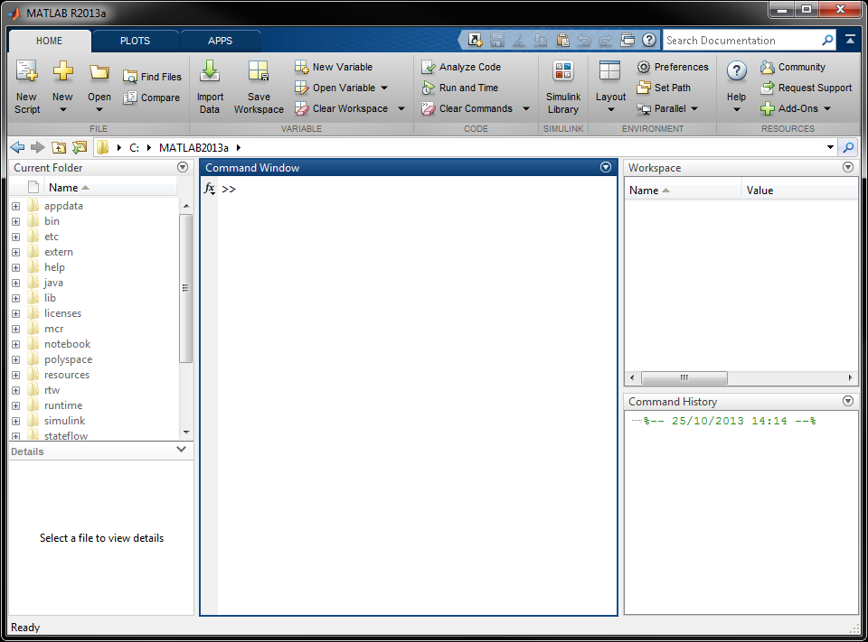

*Hình 4.18: Giao diện MATLAB. Hình gốc dùng MATLAB R2013a; bản hiện tại có thể khác nhưng các panel chính tương tự.*

(c) Ta đặt Current Folder thành:

```text
C:\Zynq_Book\hdl_coder_lms
```

Trong thư mục này, ta cần thấy các file:

- `original_speech.wav` - đoạn âm thanh speech ngắn.
- `setup.m` - script đưa sample âm thanh vào MATLAB workspace và thiết lập sample rate.
- `lms.slx` - mô hình Simulink thực hiện LMS noise cancellation.
- `playback.m` - script phát lại âm thanh để kiểm tra kết quả lọc.

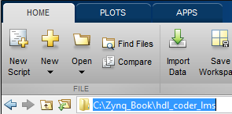

*Hình 4.19: Đặt working directory trong MATLAB.*

(d) Ta mở mô hình:

```text
lms.slx
```

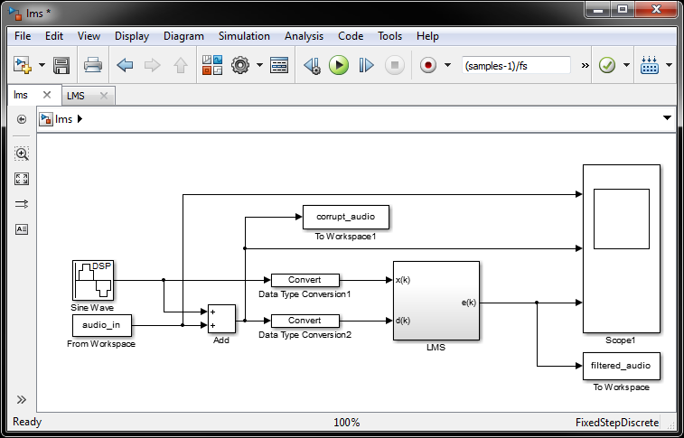

*Hình 4.20: Mô hình LMS trong Simulink.*

Trong mô hình này:

- Block **Sine Wave** tạo nhiễu dạng tone.
- Block **From Workspace** đưa tín hiệu speech từ MATLAB workspace vào mô hình.
- Hai tín hiệu được cộng lại để tạo tín hiệu speech bị nhiễu.
- Các block **Data Type Conversion** chuyển dữ liệu sang fixed-point, vì HDL Coder cần kiểu dữ liệu phù hợp để sinh HDL.
- Subsystem **LMS** thực hiện lọc thích nghi.

(e) Ta double-click vào subsystem **LMS** để xem bên trong.

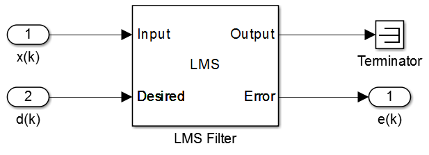

*Hình 4.21: Subsystem LMS chứa LMS Filter block.*

(f) Ta double-click vào **LMS Filter** để xem tham số. Theo tutorial, filter có 16 hệ số thích nghi và step size là `0.1`.

(g) Ta quay lại mô hình cha bằng nút **Up To Parent**.


*Hình 4.21a: Nút Up To Parent để quay lại mô hình cấp trên.*

## Mở HDL Workflow Advisor

(h) Ta bấm chuột phải vào subsystem **LMS**, chọn:

```text
HDL Code > HDL Workflow Advisor
```

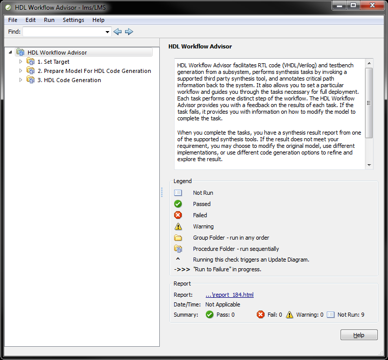

*Hình 4.22: HDL Workflow Advisor dùng để kiểm tra model và sinh HDL/IP core.*

(i) Trong panel bên trái, ta mở:

```text
Set Target > 1.1 Set Target Device and Synthesis Tool
```

Ta cấu hình:

- Target workflow: **IP Core Generation**
- Target platform: **Generic Xilinx Platform**
- Synthesis tool: **Xilinx Vivado** nếu UI yêu cầu chọn

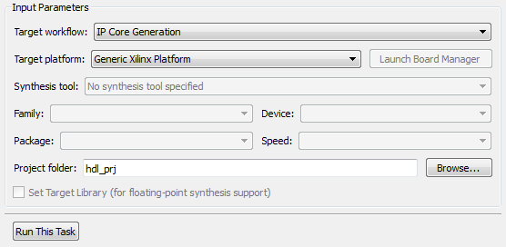

*Hình 4.23: Chọn IP Core Generation và Generic Xilinx Platform.*

(j) Ta chọn **Run This Task**.

(k) Ta chọn mục **Set Target Interface**.

Trong bản cũ, ta chọn **Coprocessing - blocking**, hệ thống tự infer AXI4-Lite cho các port. Trong HDL Coder bản mới, UI có thể hiển thị bảng ánh xạ interface. Khi đó ta map các port điều khiển/dữ liệu của DUT sang:

```text
AXI4-Lite
```

Nếu có mục Processor/FPGA synchronization, ta chọn:

```text
Coprocessing - blocking
```

(l) Ta chọn **Run This Task**.

## Kiểm tra model trước khi sinh HDL

(m) Ta mở:

```text
Prepare Model for HDL Code Generation > Check Global Settings
```

Ta chọn **Run This Task**.

Nếu task fail vì model settings, ta chọn **Modify All** để HDL Workflow Advisor tự sửa các thiết lập cần thiết.

(n) Ta chạy tiếp các bước kiểm tra còn lại, ví dụ bấm chuột phải vào **Check Sample Times** rồi chọn:

```text
Run to Selected Task
```

Tất cả check nên pass trước khi ta sinh HDL.

## Chọn Verilog và sinh IP core

(o) Ta mở:

```text
HDL Code Generation > Set Code Generation Options > Set Basic Options
```

(p) Ta chọn:

- Language: **Verilog**
- Có thể bật code generation report nếu muốn xem báo cáo chi tiết.

(q) Ta mở **Set Advanced Options**. Nếu không có yêu cầu đặc biệt, ta giữ mặc định.

(r) Ta bấm chuột phải vào **Set Advanced Options**, chọn:

```text
Run to Selected Task
```

(s) Ta chọn:

```text
Generate RTL Code and IP Core
```

Ta đặt IP core name:

```text
lms_pcore
```

Sau đó chọn **Run This Task**.

Sau khi sinh HDL xong, HDL Coder sẽ mở Code Generation Report. Ta kiểm tra:

- Ngôn ngữ RTL là **Verilog**.
- IP có interface AXI4-Lite.
- Có folder IP core, thường nằm dưới:

```text
C:\Zynq_Book\hdl_coder_lms\hdl_prj\ipcore
```

Tên folder có thể khác bản cũ. Ta dùng đúng đường dẫn mà HDL Workflow Advisor hiển thị ở mục **IP core folder**.

## Đóng gói IP trong Vivado 2022.2

Trong nhiều phiên bản HDL Coder mới, IP sinh ra đã có cấu trúc đóng gói để thêm vào Vivado IP Catalog. Tuy nhiên, để giữ đúng nội dung bài lab, ta vẫn kiểm tra và package bằng Vivado IP Packager.

(t) Ta mở Vivado 2022.2 và tạo project mới:

- Project name: `lms_packaging`
- Project location: `C:\Zynq_Book\hdl_coder_lms`
- Target language: **Verilog**
- Board: **ZedBoard Zynq Evaluation and Development Kit**

(u) Khi project mở ra, ta chọn:

```text
Tools > Create and Package New IP...
```

Chọn **Next**.

(v) Ta chọn:

```text
Package a specified directory
```

Chọn **Next**.

(w) Ở **IP location**, ta trỏ tới folder IP core do HDL Coder sinh ra, ví dụ:

```text
C:\Zynq_Book\hdl_coder_lms\hdl_prj\ipcore\lms_pcore_v1_0
```

Nếu folder của ta là `lms_pcore_v1_00_a` hoặc tên khác, ta chọn đúng folder thực tế.

(x) Ta chọn **Next**, giữ project name/location mặc định cho IP Packager, rồi chọn **Finish**.

(y) Trong IP Packager, ta chọn **IP Ports and Interfaces**. Nếu Vivado chưa tự infer AXI interface, ta bấm chuột phải vùng trống và chọn:

```text
Auto Infer Interface...
```

Sau đó chọn:

```text
aximm
```

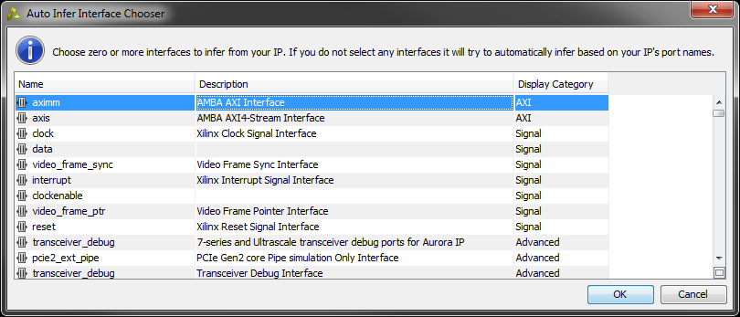

*Hình 4.24a: Auto infer AXI memory-mapped interface cho IP do HDL Coder sinh ra.*

(z) Ta chọn **IP Addressing and Memory**. Nếu Range bị đặt sai, ví dụ `4294967296`, ta sửa lại thành giá trị hợp lý theo register map của HDL Coder. Trong tutorial gốc, giá trị được sửa thành:

```text
32
```

(aa) Ta chọn **Review and Package**, kiểm tra summary, rồi chọn **Package IP**.

Kết thúc bài tập 4B, ta đã biết:

- Dùng Simulink để mô phỏng và quan sát mô hình LMS.
- Dùng HDL Workflow Advisor để kiểm tra model trước khi sinh HDL.
- Cấu hình HDL Coder sinh **Verilog**.
- Sinh IP core có AXI4-Lite interface.
- Package IP để dùng trong Vivado IP Integrator.

---

# Exercise 4C: Creating IP in Vitis HLS

## Creating IP in Vitis HLS

Trong bài tập cuối, ta tạo một IP core thực hiện chức năng **Numerically Controlled Oscillator (NCO)**. Bản gốc dùng Vivado HLS 2014.1; với Vivado 2022.2, ta dùng **Vitis HLS 2022.2**.

HLS dùng C/C++ làm mô tả thuật toán đầu vào, sau đó sinh RTL. Vì thầy yêu cầu Verilog, ta cấu hình output RTL của HLS là **Verilog**.

## Tạo project Vitis HLS

(a) Ta mở **Vitis HLS 2022.2**:

```text
Start > Xilinx Design Tools > Vitis HLS 2022.2
```

hoặc chạy:

```text
C:\Xilinx\Vitis_HLS\2022.2\bin\vitis_hls.bat
```

Tùy cách cài đặt, shortcut có thể nằm trong thư mục Vitis.

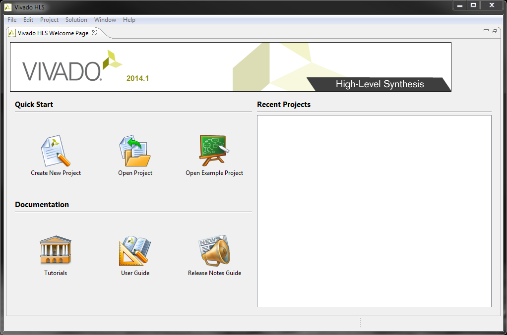

*Hình 4.24: Màn hình Getting Started của Vivado HLS bản cũ. Trong 2022.2, ta dùng Vitis HLS nhưng luồng tạo project tương tự.*

(b) Ta chọn **Create New Project** hoặc:

```text
File > New Project
```

(c) Ta nhập:

- Project name: `hls_nco`
- Location: `C:\Zynq_Book`

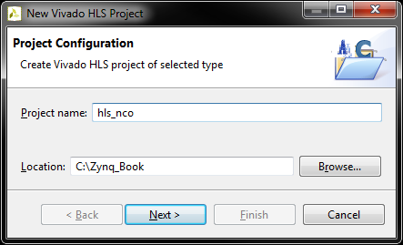

*Hình 4.25: Tạo project HLS `hls_nco`. Hình gốc là Vivado HLS 2014.1; trong Vitis HLS 2022.2 tên wizard có thể khác nhẹ.*

Ta chọn **Next**.

(d) Ở trang thêm source, ta nhập Top Function:

```text
nco
```

Ta chọn **Add Files...** và thêm:

```text
D:\Projects\Vivado\Zynq_Book_Lab04\sources\hls_nco\nco.cpp
```

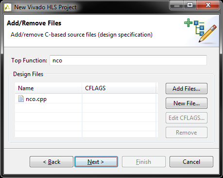

*Hình 4.26: Thêm source `nco.cpp` và đặt top function là `nco`.*

Ta chọn **Next**.

(e) Ở trang thêm testbench, ta chọn **Add Files...** và thêm:

```text
D:\Projects\Vivado\Zynq_Book_Lab04\sources\hls_nco\nco_tb.cpp
```

Ta chọn **Next**.

(f) Ở trang solution configuration, ta chọn board ZedBoard nếu có. Nếu không thấy board, ta chọn part:

```text
xc7z020clg484-1
```

Ta đặt clock period phù hợp, ví dụ:

```text
10 ns
```

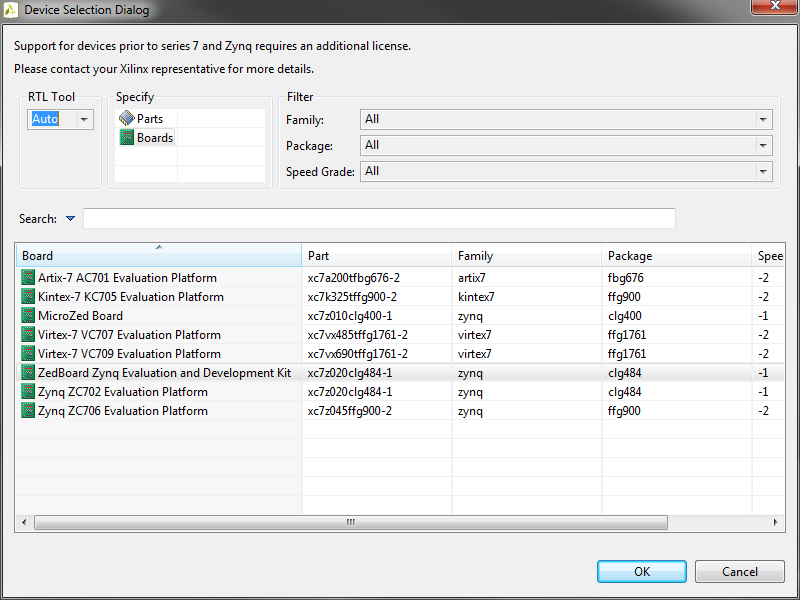

*Hình 4.27: Chọn target board/part cho HLS solution.*

(g) Ta chọn **Finish** để tạo project.

## Kiểm tra source NCO

(h) Trong Explorer, ta kiểm tra có:

- Source: `nco.cpp`
- Test Bench: `nco_tb.cpp`

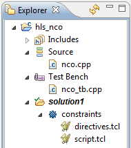

*Hình 4.28: Cây project HLS gồm source, testbench và solution.*

(i) Ta mở `nco.cpp`. Nếu ta có bộ source gốc của tutorial, nội dung có thể dùng lookup table lớn `sine_lut[4096]`. Nếu ta không có bộ source gốc và dùng source thay thế trong thư mục:

```text
D:\Projects\Vivado\Zynq_Book_Lab04\sources\hls_nco
```

thì file `nco.cpp` sẽ dùng lookup table 16 mẫu để bài chạy gọn hơn nhưng vẫn đúng ý tưởng NCO.

File này dùng các thư viện:

```cpp
#include "ap_fixed.h"
#include "ap_int.h"
```

`ap_fixed.h` hỗ trợ kiểu fixed-point chính xác tùy ý trong HLS, còn `ap_int.h` hỗ trợ kiểu integer có độ rộng bit tùy ý như `ap_uint<16>`.

Trong source thay thế có các kiểu dữ liệu:

```cpp
typedef ap_fixed<16, 2> sample_t;
typedef ap_ufixed<16, 12> step_t;
```

- `sample_t`: mẫu sin signed fixed-point 16 bit, gồm 2 bit phần nguyên và 14 bit phần thập phân.
- `step_t`: giá trị bước pha unsigned fixed-point 16 bit.

Hàm top có dạng:

```cpp
void nco(sample_t *sine_sample, step_t step_size)
```

Trong đó:

- `sine_sample` là output sample của NCO.
- `step_size` điều khiển bước nhảy pha, từ đó điều khiển tần số ngõ ra.

Trong source thay thế, hàm `nco` đã có sẵn pragma AXI4-Lite:

```cpp
#pragma HLS INTERFACE mode=s_axilite port=return bundle=control
#pragma HLS INTERFACE mode=s_axilite port=sine_sample bundle=control
#pragma HLS INTERFACE mode=s_axilite port=step_size bundle=control
```

Vì vậy, nếu dùng source thay thế này, ta không cần thêm directive bằng GUI ở bước sau.

Bên trong hàm có:

- `static ap_uint<16> phase_acc`: thanh ghi tích lũy pha.
- `sine_lut[16]`: bảng tra sin gồm 16 mẫu.
- `phase_acc += step_bits`: cập nhật pha theo `step_size`.
- `lut_index = phase_acc.range(15, 12)`: lấy 4 bit cao của phase accumulator để chọn một trong 16 mẫu sin.

(j) Ta mở `nco_tb.cpp`. Testbench sẽ gọi hàm `nco` 64 lần và ghi kết quả ra file:

```cpp
const char *outfile = "nco_sine.m";
```

File này sẽ được tạo trong thư mục chạy C Simulation của Vitis HLS. Nếu muốn lưu ra đường dẫn tuyệt đối, ta có thể sửa thành đường dẫn trên máy mình, nhưng không bắt buộc.

## Chạy C Simulation

(k) Ta chọn:

```text
Run C Simulation
```

Giữ thiết lập mặc định rồi chọn **OK**.

Nếu simulation đúng, console sẽ báo hoàn tất và file output chứa các mẫu sin được tạo ra.

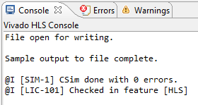

*Hình 4.29a: Console báo C simulation hoàn tất.*

Nếu muốn, ta có thể import file output vào MATLAB để vẽ dạng sóng sin.

## Thêm directive AXI4-Lite trong Vitis HLS 2022.2

Trong bản gốc, Vivado HLS dùng directive `RESOURCE` với core `AXI4LiteS`. Với Vitis HLS 2022.2, cách rõ ràng hơn là dùng pragma `INTERFACE mode=s_axilite`.

Nếu ta dùng source thay thế đã tạo ở:

```text
D:\Projects\Vivado\Zynq_Book_Lab04\sources\hls_nco\nco.cpp
```

thì các pragma này đã nằm sẵn trong đầu hàm `nco`:

```cpp
void nco(sample_t *sine_sample, step_t step_size)
{
#pragma HLS INTERFACE mode=s_axilite port=return bundle=control
#pragma HLS INTERFACE mode=s_axilite port=sine_sample bundle=control
#pragma HLS INTERFACE mode=s_axilite port=step_size bundle=control

    /* Phần thân hàm NCO */
}
```

Ý nghĩa:

- `s_axilite port=return bundle=control`: tạo AXI4-Lite control interface cho IP.
- `s_axilite port=sine_sample bundle=control`: ánh xạ output sample vào AXI4-Lite.
- `s_axilite port=step_size bundle=control`: ánh xạ input điều khiển vào AXI4-Lite.

Do pragma đã có trong code, trong project của ta **không cần thêm directive bằng GUI nữa**. Ta chỉ cần kiểm tra trong tab **Directive** xem Vitis HLS đã nhận các interface này hay chưa.

(l) Mở tab **Directive**.

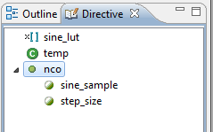

*Hình 4.29: Tab Directive trong HLS.*

(m) Ta kiểm tra function `nco` có các directive/interface tương ứng:

```text
INTERFACE mode=s_axilite, port=return, bundle=control
INTERFACE mode=s_axilite, bundle=control
INTERFACE mode=s_axilite, bundle=control
```

Nếu ta đang dùng source gốc của tutorial và file chưa có pragma, lúc đó mới cần thêm directive bằng GUI hoặc thêm ba dòng pragma ở trên vào đầu hàm `nco`.

Sau khi kiểm tra xong, directive list sẽ có dạng tương tự hình dưới.

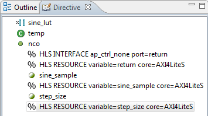

*Hình 4.30: Directive hoàn chỉnh cho NCO. Trong 2022.2, tên directive hiển thị có thể là `INTERFACE s_axilite` thay cho `RESOURCE AXI4LiteS` của bản cũ.*

## Chạy C Synthesis và Export RTL

(p) Ta chọn:

```text
Run C Synthesis
```

Sau khi synthesis xong, ta kiểm tra báo cáo:

- Latency.
- Resource utilization.
- Interface được sinh ra.
- RTL language.

(q) Ta chọn:

```text
Export RTL
```

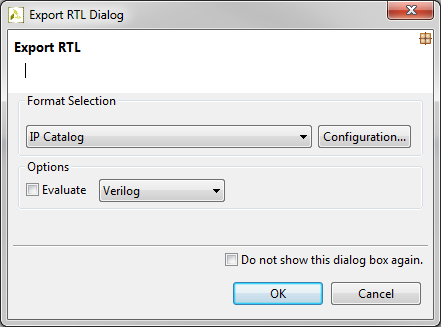

*Hình 4.31: Export RTL. Trong Vitis HLS 2022.2, ta chọn format Vivado IP và output language là Verilog nếu có tùy chọn.*

(r) Trong hộp thoại Export RTL, ta chọn:

- Export format: **Vivado IP** hoặc **Vivado IP (.zip)**
- Output language: **Verilog**
- Version: `1.0`
- Có thể chỉnh Vendor/Library/Name nếu muốn.

Sau đó chọn **OK** hoặc **Export**.

Khi export hoàn tất, HLS tạo IP tại:

```text
C:\Zynq_Book\hls_nco\solution1\impl\ip
```

và thường có file ZIP:

```text
C:\Zynq_Book\hls_nco\solution1\impl\export.zip
```

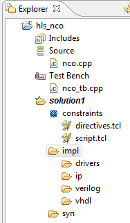

*Hình 4.32: Thư mục `impl/ip` chứa IP do HLS sinh ra.*

## Thêm IP HLS vào Vivado IP Catalog

Để dùng IP NCO trong Vivado IP Integrator, ta thêm thư mục IP HLS vào repository:

(s) Trong Vivado, ta mở:

```text
Tools > Settings > IP > Repository
```

(t) Ta chọn dấu **+**, rồi thêm thư mục:

```text
C:\Zynq_Book\hls_nco\solution1\impl\ip
```

(u) Ta chọn **Apply**, rồi **OK**. Sau đó trong IP Catalog, ta tìm `nco`.

Kết thúc bài tập 4C, ta đã biết:

- Dùng Vitis HLS để tạo project từ C/C++.
- Chạy C Simulation để kiểm tra thuật toán.
- Dùng directive `INTERFACE s_axilite` để tạo AXI4-Lite slave interface.
- Chạy C Synthesis.
- Export RTL thành Vivado IP với output Verilog.
- Thêm IP HLS vào Vivado IP Catalog.

---

# Kết quả đạt được

Sau khi hoàn thành Lab 4 bằng Vivado/Vitis 2022.2, ta đạt được:

- Tạo và đóng gói custom IP tương thích AXI4-Lite.
- Viết custom IP bằng Verilog.
- Kết nối IP với Zynq Processing System trong Vivado IP Integrator.
- Generate bitstream cho ZedBoard Zynq-7020.
- Export hardware sang Vitis bằng file `.xsa`.
- Viết chương trình C điều khiển IP từ ARM PS.
- Sinh HDL/IP tự động từ Simulink bằng HDL Coder.
- Sinh IP từ C/C++ bằng Vitis HLS và cấu hình RTL output là Verilog.

# Các lỗi thường gặp trong Vivado/Vitis 2022.2

**Không thấy ZedBoard trong tab Boards**

Ta cài board files từ Xilinx Board Store hoặc thêm board repository. Nếu cần làm nhanh, ta chọn part `xc7z020clg484-1`, nhưng nên có board preset để Zynq PS được cấu hình đúng cho ZedBoard.

**XDC báo không tìm thấy `LEDs_out`**

External port trong block design có thể bị Vivado đặt tên `LEDs_out_0`. Ta đổi tên external port thành `LEDs_out`, hoặc sửa XDC theo tên port thực tế.

**Vitis không nhận macro base address**

Ta mở `xparameters.h`, tìm `LED_CONTROLLER`, rồi dùng đúng macro `BASEADDR` mà Vitis sinh ra.

**Application chạy nhưng LED không đổi**

Ta kiểm tra lại các điểm sau:

- Đã program FPGA bằng bitstream mới chưa.
- File `.xsa` export có chọn **Include bitstream** chưa.
- Base address trong `xparameters.h` có đúng với Address Editor không.
- XDC có đúng tên port external không.
- ZedBoard đã nối nguồn, USB JTAG và UART đúng chưa.

**HDL Coder không tìm thấy Vivado**

Ta chạy trong MATLAB:

```matlab
hdlsetuptoolpath('ToolName','Xilinx Vivado', ...
    'ToolPath','C:\Xilinx\Vivado\2022.2\bin\vivado.bat');
```

Sau đó mở lại HDL Workflow Advisor.

# Nguồn tham khảo cập nhật 2022.2

- AMD/Xilinx UG1118 2022.2, Creating and Packaging Custom IP: https://www.xilinx.com/support/documents/sw_manuals/xilinx2022_2/ug1118-vivado-creating-packaging-custom-ip.pdf
- AMD UG994 2022.2, Vivado IP Integrator: https://docs.amd.com/r/2022.2-English/ug994-vivado-ip-subsystems
- AMD UG1399 2022.2, Vitis HLS, interface pragma và Export RTL: https://docs.amd.com/r/2022.2-English/ug1399-vitis-hls/pragma-HLS-interface
- AMD UG1400 2022.2, tạo platform từ XSA và application trong Vitis: https://docs.amd.com/r/2022.2-English/ug1400-vitis-embedded/Creating-a-Platform-Project-from-XSA
- MathWorks HDL Coder IP Core Generation: https://www.mathworks.com/help/hdlcoder/generate-ip-core-and-bitstream.html
- Xilinx Board Store cho board files: https://github.com/Xilinx/XilinxBoardStore
