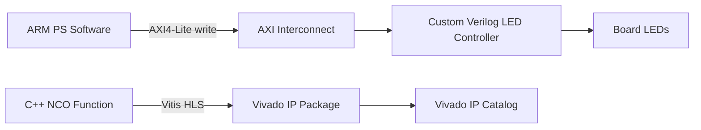

# IP Creation on Zynq SoC


This repository documents and packages a Zynq hardware/software co-design lab focused on custom IP creation, AXI4-Lite integration, and processor-controlled FPGA logic.

The project was rebuilt for the Vivado/Vitis 2022.2 workflow and uses Verilog for the hand-written RTL IP.

## Project Scope

The lab explores three IP creation paths:

| Exercise | Method | Deliverable |
|---|---|---|
| 4A | Hand-written HDL | Verilog AXI4-Lite `led_controller` IP |
| 4B | MathWorks HDL Coder | Documented workflow for Simulink-to-IP generation |
| 4C | Vitis HLS | C++ NCO synthesized and exported as Vivado IP |

The main implemented artifacts are:

- A memory-mapped AXI4-Lite LED controller written in Verilog.
- A Vitis HLS numerically controlled oscillator (NCO) exported as a Vivado IP package.
- A Vietnamese tutorial updated from the 2014.1 flow to Vivado/Vitis 2022.2.

## System Architecture



## Skills Demonstrated

- AXI4-Lite slave peripheral creation and packaging
- Verilog RTL modification inside the Vivado IP Packager template
- IP repository management in Vivado
- Zynq Processing System integration through IP Integrator
- Vitis platform/application workflow from exported XSA hardware
- Memory-mapped software control using `Xil_Out32`
- Vitis HLS IP export using `s_axilite` interfaces

## Repository Layout

```text
.
|-- Lab04_Vivado_2022_2_Verilog.md     # Step-by-step Vietnamese guide
|-- sources/
|   `-- hls_nco/
|       |-- nco.cpp                     # Vitis HLS NCO source
|       `-- nco_tb.cpp                  # C simulation testbench
|-- ip_repo/
|   |-- led_controller_1_0/             # Packaged Verilog AXI4-Lite IP
|   `-- hls_nco_ip/                    # Vitis HLS exported NCO IP
|-- hls_nco_export/
|   `-- export.zip                     # Packaged HLS IP archive
`-- tutorial4_extract/
    `-- figures/                       # Small figures used by the guide
```

Large generated Vivado/Vitis workspaces, bitstreams, and the original tutorial PDF are intentionally excluded from version control.

## Key Implementation Details

### Verilog LED Controller

The AXI4-Lite template exposes four 32-bit slave registers. The user logic maps the lower eight bits of `slv_reg0` to an external LED port:

```verilog
assign LEDs_out = slv_reg0[7:0];
```

Software running on the ARM Processing System writes to register offset `0x00`:

```c
Xil_Out32(LED_CONTROLLER_BASEADDR + 0x00U, value);
```

### Vitis HLS NCO

The NCO is described in C++ using fixed-point types and exported as a Vivado IP with AXI4-Lite control registers:

```cpp
#pragma HLS INTERFACE mode=s_axilite port=return bundle=control
#pragma HLS INTERFACE mode=s_axilite port=sine_sample bundle=control
#pragma HLS INTERFACE mode=s_axilite port=step_size bundle=control
```

The generated IP includes RTL, drivers, metadata, and a `component.xml` file for Vivado IP Catalog discovery.

## How to Use the IP Packages

### Add the LED Controller IP

1. Open a Vivado project for a Zynq-7000 target.
2. Go to `Tools > Settings > IP > Repository`.
3. Add this directory:

```text
ip_repo/led_controller_1_0
```

4. In a block design, use `Add IP` and search for `led_controller`.

### Add the HLS NCO IP

1. Open `Tools > Settings > IP > Repository`.
2. Add this directory:

```text
ip_repo/hls_nco_ip
```

3. Use `Add IP` and search for `nco`.

## Reproducing the HLS Export

Open Vitis HLS 2022.2 and create a project with:

- Top function: `nco`
- Source: `sources/hls_nco/nco.cpp`
- Testbench: `sources/hls_nco/nco_tb.cpp`
- Target part: Zynq-7020 compatible part, for example `xc7z020clg484-1`

Then run:

1. C Simulation
2. C Synthesis
3. Export RTL

Export settings:

```text
Export Format : Vivado IP (.zip)
RTL           : Verilog
```

## Documentation

The full lab guide is available here:

[Lab04_Vivado_2022_2_Verilog.md](Lab04_Vivado_2022_2_Verilog.md)

It includes the 2022.2 tool-flow updates, Verilog edits, Vitis migration notes, HLS steps, and known issues encountered during the lab.

## Notes

- Exercise 4B requires MATLAB, Simulink, and HDL Coder desktop tools. The workflow is documented, while the reproducible repository artifacts focus on Vivado/Vitis-based work.
- The repository is intentionally kept small by excluding generated project caches and full build directories.
- Hardware execution requires a Zynq development board such as ZedBoard or an equivalent Zynq-7000 target with matching constraints.
